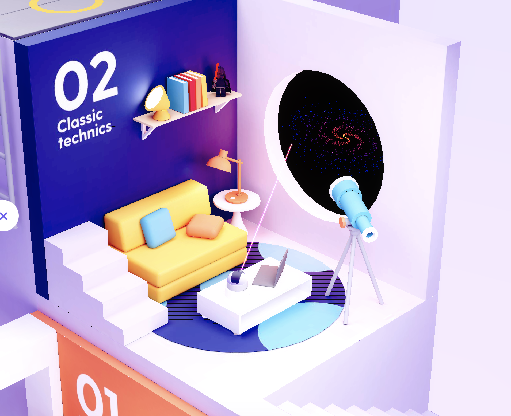

# Web Graphics Project

## Team Members
* Javier Pascal Flores A01375925
* Ricardo David Zambrano Figueroa A01379700
* Jorge Damián Palacios Hristova A01654203

## Project Definition:

This project will present a limited scene in the form of a room with decoration and elements with wich you can interact.

The room aesthetic and theme that we will follow are movie elements and references.

There will be 9 elements with animation:

1. Thors Hammers that levitates  a little and  there is like thunders around it 
2. A light saber that extends and retracts with a color red or blue
3. A spinner like in the movie Inception that when click starts spinning for a random time making a reference like it is a dream
4. 
5. 
6. 
7. 
8. 
9. 

In addition to the elements with animation there might be some non-animated decorations.

### Example Image

This is the original inspiration for this project, it belongs to [Three.js Journey - Learn WebGL with Three.js](http://threejs-journey.xyz/) website.

---

## Technologies to use
* WebGL
* ThreeJS 
* JavaScript 
* React/Angular 
* HTML

## Requirements

* Sketches
* Elements
* Description of Interactions
* Post Processing in JS
* Effects
* Each element has to have an interaction
